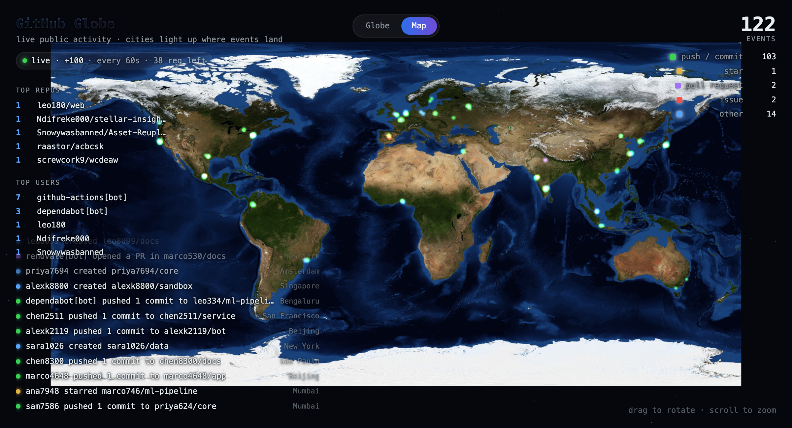

# GitHub World

A rotating 3D globe (and flat map) that lights up with **live public GitHub
activity**. Every commit, star, pull request and issue from the
[public Events API](https://docs.github.com/en/rest/activity/events) lands on a
city and glows, while a live ticker and leaderboards track the busiest repos,
users, bots and countries.

Built with **Vue 3** + **Three.js** + **Vite**. Runs as a static site — no
backend required.

🌍 **Live:** https://mist1985.github.io/githubworld/



## Run it

```bash
npm install
npm run dev        # http://localhost:5173
npm run build      # production bundle in dist/
npm run preview    # serve the production build
```

## Features

- **Globe & Map views** — a textured 3D Earth (drag to rotate, scroll to zoom) or
  a flat equirectangular world map. Toggle top-center.
- **City lights** — each event glows on at its location for ~2s, then fades. Busy
  cities light up again and again.
- **Live ticker** — real commits/PRs/issues scroll by continuously (paced so they
  stream smoothly instead of arriving in one clump).
- **Leaderboards** — Top Repos, Top Users, Top Bots (kept separate), and Top
  Countries with flags 🇺🇸🇮🇳🇯🇵 — all from **real** public-repo events.
- **Starts where you are** — the globe opens facing your region (from your
  timezone, refined by geolocation if you allow it).
- **Responsive** — adapts to desktop, tablet and mobile.

### Event colors

| Color | Event |
|-------|-------|
| 🟢 green | push / commit |
| 🟡 amber | star |
| 🟣 purple | pull request |
| 🔴 red | issue |
| 🔵 blue | other |

## How it works

| Piece | File | Notes |
|-------|------|-------|
| Event stream | `src/github.js` | Polls `/events` (via a dev Vite proxy to dodge CORS; directly from the browser in production). Dedupes by id and **self-tunes the poll rate** to the rate-limit budget. A steady **heartbeat of simulated origin points** keeps the map glowing between GitHub's ~1/min refreshes. |
| Geolocation | `src/locations.js` | GitHub doesn't expose event locations, so each actor is **deterministically hashed** onto one of ~34 world cities (weighted toward dev hubs), each tagged with an ISO country code for the flags. |
| Rendering | `src/globe.js` | Textured Earth sphere + flat map (`public/earth.jpg`), atmosphere glow, starfield, and a pooled sprite system for the city-light dots. `fitCamera()` keeps the globe framed at any aspect ratio. |
| UI / loop | `src/App.vue` | Animation loop, drag/zoom controls, geolocation start position, and the HUD (ticker, counters, leaderboards, footer). |

> `public/earth.jpg` (an equirectangular Earth map) provides the globe/map
> texture and is required.

**Real vs. simulated:** the ticker, counters and leaderboards are driven by
**real** GitHub events only. The map is lit by both real events and the
simulated heartbeat, so it stays visually alive even while the API is between
refreshes or rate-limited. Bots (`*[bot]`) are split into their own table so
Top Users shows real people.

## Deploy to GitHub Pages

It's a static site — the browser calls `api.github.com` directly (GitHub allows
CORS) and assets use relative paths (`base: './'`), so it works from a project
subpath. A workflow is included at `.github/workflows/deploy.yml`:

1. Push this repo to GitHub with the default branch named `main`.
2. In **Settings → Pages**, set **Source: GitHub Actions**.
3. Push — the workflow builds and publishes automatically.

On Pages it runs **unauthenticated**. **Do not** bake a token into the build — it
would be public in the bundle. The token path below is for local runs only.

## How live is it?

Two hard limits come from GitHub, not this app:

1. **The public feed is ~5 minutes delayed.** The newest event `/events` returns
   is about 5 minutes old — there's no lower-latency public REST feed.
2. **Rate limits are per IP.** Unauthenticated = **60 requests/hour per visitor
   IP**, and every poll costs one request. So the sustainable poll rate without a
   token is ~60s, and each visitor has their own independent budget.

Within those limits it stays lively: real events are buffered and streamed into
the ticker at a steady pace, and the heartbeat keeps the map glowing continuously.

### Near-live: add a token (local dev)

A token raises the limit to **5,000/hour**, so it can poll every few seconds. The
dev proxy attaches it **server-side**, so it never reaches the browser:

```bash
GITHUB_TOKEN=ghp_your_token npm run dev
```

A classic token with **no scopes** (public data only) is enough.

## Privacy & security

- Only **public** GitHub data is ever read; no private repos are or can be shown
  through this API.
- No auth is sent from the browser, no cookies, no tracking. Geolocation (if
  granted) is used only to orient the globe and is never transmitted.
- The optional token stays server-side in dev and is never in the build.

## Author & license

**Mihajlo Stojanovski** — v1.0, July 2026 · [Contact](https://github.com/mist1985)

Licensed under the [MIT License](LICENSE).
